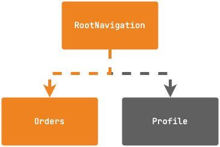

# Navigation with Deeplink

## Test

### Orders

`adb shell am start -a android.intent.action.VIEW -d "https://navigation.rakangsoftware.com/orders/" com.rakangsoftware.navigation`

### Profile

`adb shell am start -a android.intent.action.VIEW -d "https://navigation.rakangsoftware.com/profile/" com.rakangsoftware.navigation`
